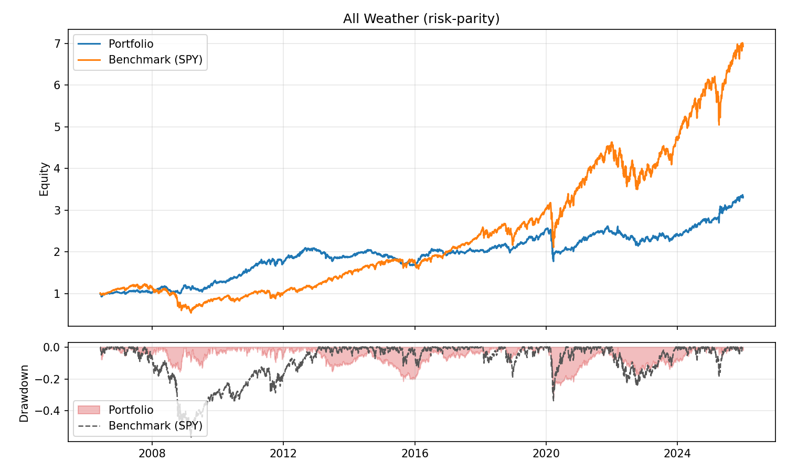

# 全天候投资组合回测

这个项目提供一个简洁的「All Weather/全天候」资产配置回测脚本，支持风险平价、逆波动与固定权重，并可进行目标波动率控制与杠杆上限约束。



```bash
Backtest Summary
---------------
Data source     : stooq
Tickers         : SPY, TLT, IEF, GLD, DBC
Benchmark       : SPY
Period          : 2006-06-01 -> 2025-12-31
Rebalance       : M
Portfolio       : risk-parity
Data cache      : data
Data format     : csv
Data refresh    : off
Target vol      : 0.00%
Max leverage    : 1.00x
Trade cost      : 0.0 bps
Borrow rate     : 0.00%
Cash rate       : 0.00%

Avg Gross Lev   : 1.00x
Max Gross Lev   : 1.00x

Performance
Total Return    : 229.94%
CAGR            : 6.30%
Ann. Vol        : 11.26%
Sharpe (rf=0)   : 0.56
Max Drawdown    : -31.09%

Benchmark (SPY)
Total Return    : 592.81%
CAGR            : 10.41%
Ann. Vol        : 19.54%
Sharpe (rf=0)   : 0.53
Max Drawdown    : -56.47%
Plot saved to   : out/equity_drawdown.png
```

## 功能

* 组合权重：`risk-parity`、`inverse-vol`、`fixed`
* 波动率目标：按滚动窗口估计组合波动，控制目标波动与最大杠杆
* 交易成本/融资成本：按换手率计费，支持借贷利率与现金利率
* 数据来源：Stooq（默认，无需 API key）或 Alpaca（需要 API key）
* 数据缓存：默认存放在 `data/`，支持 CSV 或 Parquet（Parquet 需额外依赖）
* 可选输出：权重序列、组合收益、净值曲线、成本明细与运行元信息
* 可选绘图：净值 + 回撤图（需 matplotlib）

## 环境要求
* Python 3.9+
* 依赖：`numpy`、`pandas`、`requests`
* 可选：`matplotlib`（用于 `--plot`）
* 可选：`pyarrow`（或 `fastparquet`，用于 `--data-format parquet`）

## 安装

```bash
pip install -e .
```

## 使用 uv

```bash
uv sync
uv sync --extra dev
uv sync --extra plot
uv sync --extra data
```


## 快速开始
```bash
# 默认参数（Stooq，风险平价）
python all_weather_backtest.py

# 指定区间与输出目录
python all_weather_backtest.py --start 2005-01-01 --end 2024-12-31 --out out/

# 固定权重组合
python all_weather_backtest.py \
  --portfolio fixed \
  --fixed-weights "SPY=0.3,TLT=0.4,IEF=0.15,GLD=0.075,DBC=0.075"

# 启用成本与绘图
python all_weather_backtest.py --trade-cost 0.0005 --borrow-rate 0.03 --cash-rate 0.02 --plot --out out/

# 使用 Parquet 缓存价格数据
python all_weather_backtest.py --data-format parquet --out out/
```

## 使用 Alpaca 数据

```bash
export APCA_API_KEY_ID="..."
export APCA_API_SECRET_KEY="..."

python all_weather_backtest.py --data-source alpaca --alpaca-feed iex
```

## 关键参数说明

* `--data-source`：`stooq` 或 `alpaca`
* `--data-dir`：价格数据缓存目录（默认 `data/`，设为空可禁用）
* `--data-format`：缓存格式（`csv` 或 `parquet`）
* `--refresh-data`：强制刷新缓存数据
* `--tickers`：逗号分隔 ETF 列表，例如 `SPY,TLT,IEF,GLD,DBC`
* `--benchmark`：基准指数 ticker（默认 `SPY`，设为 `none` 可关闭）
* `--portfolio`：`risk-parity`、`inverse-vol`、`fixed`
* `--fixed-weights`：固定权重字符串（会自动归一化）
* `--lookback`：回看窗口（交易日）
* `--rebalance`：再平衡频率（pandas offset alias，如 `M`、`W-FRI`）
* `--target-vol`：目标年化波动率
* `--max-leverage`：最大总杠杆（默认 1.0，无杠杆）
* `--trade-cost`：交易成本（按换手率计费，0.0005 = 5 bps）
* `--borrow-rate`：借贷年化利率
* `--cash-rate`：现金年化利率
* `--out`：输出目录
* `--plot`：保存净值 + 回撤图（输出到 `--out` 或当前目录）

## 输出文件（当使用 `--out`）

* `portfolio_returns.csv`：组合日收益（含成本）
* `weights_daily.csv`：日度权重
* `equity_curve.csv`：净值曲线（含成本）
* `benchmark_returns.csv`：基准日收益（当启用 benchmark）
* `benchmark_equity_curve.csv`：基准净值曲线（当启用 benchmark）
* `costs_daily.csv`：成本明细（当启用成本）
* `portfolio_returns_gross.csv`：组合日收益（未计成本，仅当启用成本）
* `equity_curve_gross.csv`：净值曲线（未计成本，仅当启用成本）
* `run_meta.json`：本次运行参数信息

## 绘图输出（当使用 `--plot`）

* `equity_drawdown.png`：净值 + 回撤图（输出到 `--out` 或当前目录，含 benchmark 若启用）

## 数据缓存

默认缓存价格数据到 `data/`，便于复用与离线分析。需要更新数据时可使用 `--refresh-data`，或直接删除对应缓存文件。

## 测试

```bash
pip install -e ".[dev]"
./scripts/test.sh

# 使用 uv
uv sync --extra dev
uv run python -m pytest -q
```

## 备注

* 这是对 Bridgewater All Weather 思路的 ETF 代理回测。
* 再平衡权重在再平衡日估计，并在下一交易日执行以避免前视偏差。
* 支持可选交易成本/融资成本；税费与滑点仍未建模。
* 数据质量依赖于数据源，仅供学习研究，不构成投资建议。
